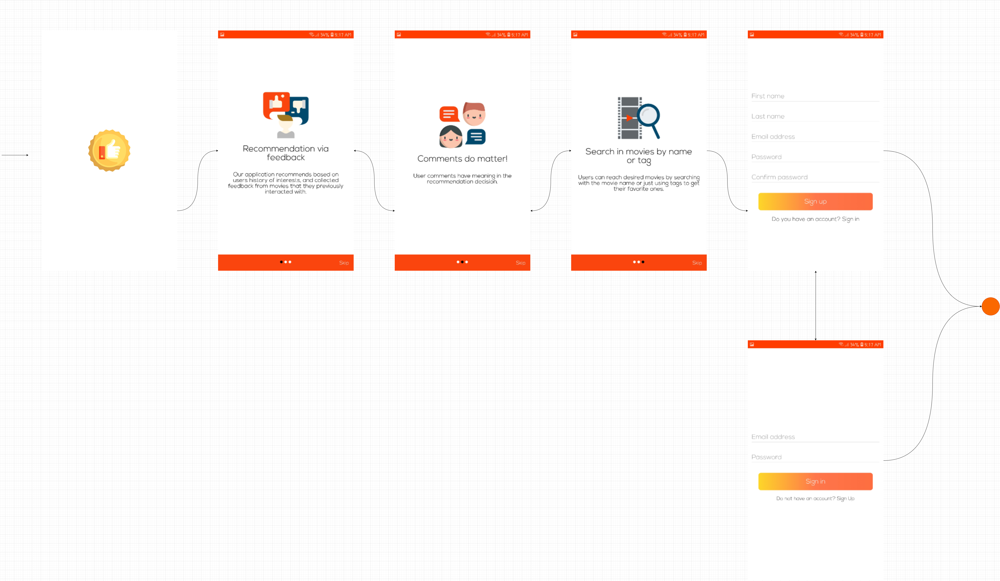
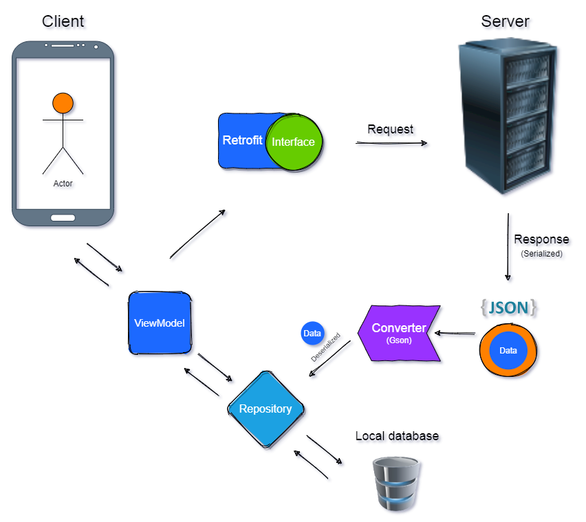

# GraduationProject
This repository is for my graduation project which is a movie recommendation system mobile application.

# Team members:
[Yommna Mohamed Hafez](https://github.com/YommnaMohamed)  
[Hamis Hisham Mahmoud](https://github.com/hamishisham)  
[Fwzia Yasser Ibrahim](https://github.com/Fwzia)  
[Israa Mohamed Mohamed Saleh](https://github.com/israa3)  
[Mostafa Magdy Abdelazeem Hegab](https://github.com/mostafaHegab)  
[Mohamed Abobakr Mohamed Elhosiny](https://github.com/Mohamed-Abobakr20)  
[Mostafa Khedre El Moghawari Abdel Hamid](https://github.com/mkhedre)  
[Mohamed El-Sayed Selim](https://github.com/Seleem1010)  
[Islam AlaaEddin Abdulal Essaid](https://github.com/eslamalaaeddin)  

# Tech. used:
Kotlin  
Java a little bit  
MVVM & Repository Design Patterns  
Retrofit2 For Networking Logic  
Gson  
Coroutines  
Koin For Dependency Injection  
Room For Caching  
Paging Library  
JetPack Navigation  
Room persistence library  
Glide  

# Overview

 

 

 

